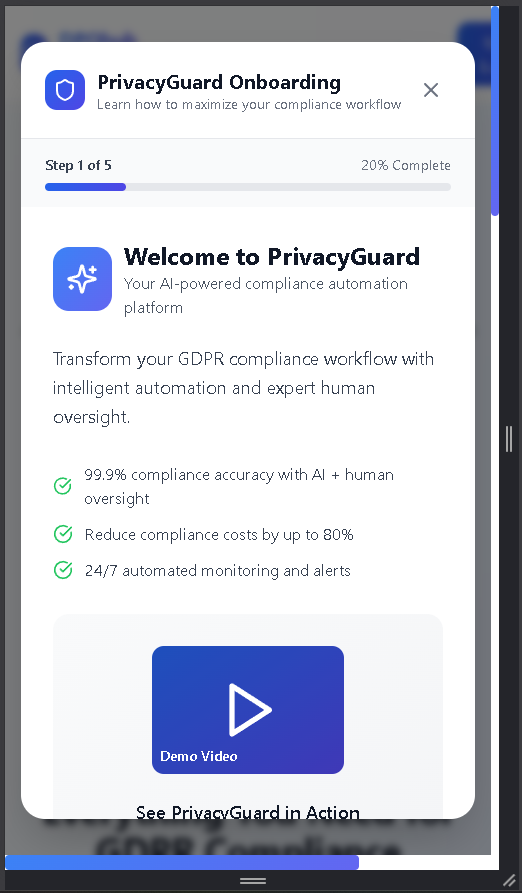

# Privacy Guard AI — DPOhub

     

> AI-powered Data Protection Officer (DPO) as a service — a compliance platform that unifies GDPR with 20+ global security frameworks and privacy laws, delivered across B2B, B2C, and API channels, with an AI consultation assistant at its core.

## Screens

### Desktop
<p align="center"></p>
<p align="center">
  
  
</p>
<p align="center">
  
  
</p>
<p align="center"></p>

### Mobile
<p align="center">
  
  
  
</p>
<p align="center">
  
  
  
</p>

## What It Is

DPOhub turns the work of a Data Protection Officer into a guided, AI-assisted platform. Organizations and individuals can assess their obligations, manage policies, run data discovery, and stay aligned with the frameworks and laws that apply to them — without needing a full in-house compliance team.

## Compliance Coverage

**Security frameworks:** ISO/IEC 27001, ISO/IEC 27701, NIST CSF, CIS Controls, SOC 2, PCI DSS, ISO 22301, NIST SP 800-53 / FedRAMP, COBIT, ITIL.

**Privacy & data-protection laws:** GDPR and ePrivacy (EU), NIS2 (EU), HIPAA, GLBA, SOX, CCPA / CPRA (California), NYDFS (US), PIPL (China), LGPD (Brazil).

## Three Channels

| Channel | For | Focus |
|---|---|---|
| **B2B** | Enterprises | Multi-framework dashboards, policy management, DPO workflows |
| **B2C / SMB** | Individuals & small teams | Guided, self-serve privacy compliance |
| **API** | Developers / platforms | Programmatic compliance via GraphQL |

## Features

- **AI consultation assistant** — voice and chat guidance for compliance questions, grounded in a curated knowledge base.
- **Policy catalog & management** — a library of policies across frameworks, with creation and tracking.
- **Data discovery & mapping** — discovery-form pipelines to map data flows and obligations.
- **Compliance dashboards** — admin and user dashboards with events, tasks, and status.
- **Service tiers** — subscription tiers for different organization sizes.
- **Ratings & marketplace** — a layer for rating and matching DPO / auditor services.

## Architecture

Built as a Cloudflare-native application:

- **Frontend:** React + Vite single-page app.
- **Backend / API:** Cloudflare Workers with Apollo GraphQL.
- **Database:** Cloudflare D1 (SQL migrations ship in `migrations/`).
- **Auth:** Google OAuth.
- **Deploy:** Wrangler (Cloudflare).

## Tech Stack

| Layer | Technology |
|---|---|
| Frontend | React · Vite · TypeScript · Tailwind |
| API | Apollo GraphQL on Cloudflare Workers |
| Database | Cloudflare D1 |
| Auth | Google OAuth |
| Deploy | Wrangler / Cloudflare |

## Run It

```bash
npm install --legacy-peer-deps
npm run dev          # frontend (Vite)
```

For the full stack (API + D1), run the Worker with Wrangler and apply the SQL in `migrations/`.

## Status

Prototype. Front-end is functional; backend runs on Cloudflare Workers + D1 (schema migrations included). Not audited; not legal advice.

## Disclaimer

Prototype / portfolio artifact. Does not constitute legal or compliance advice. Framework and law names are referenced descriptively.
