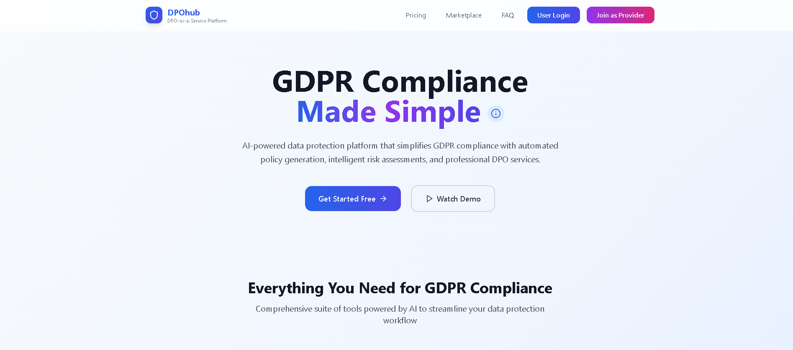
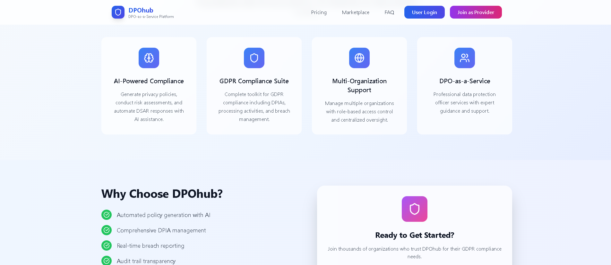
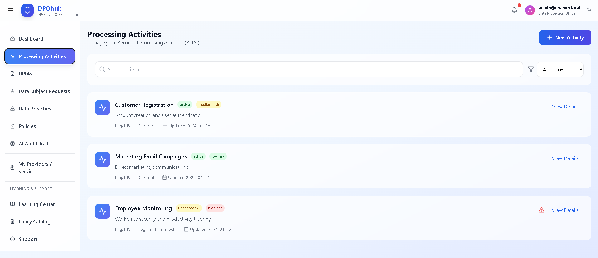
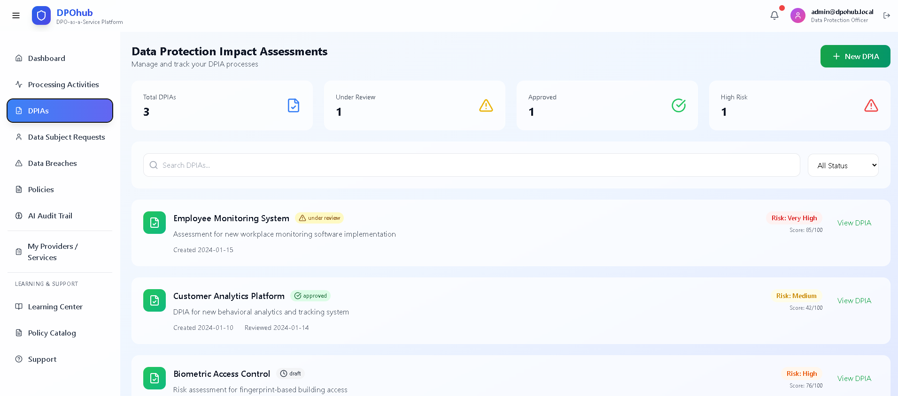
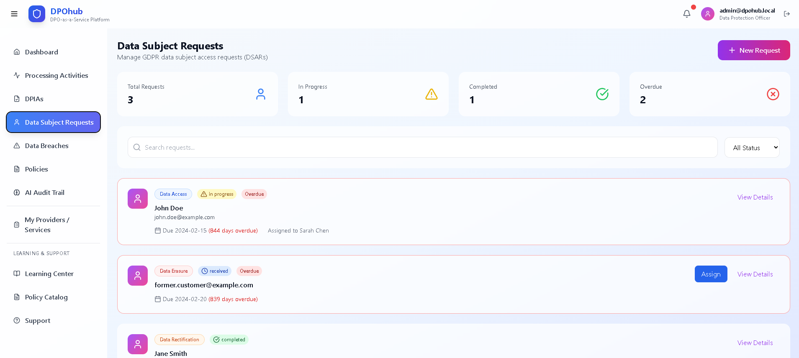
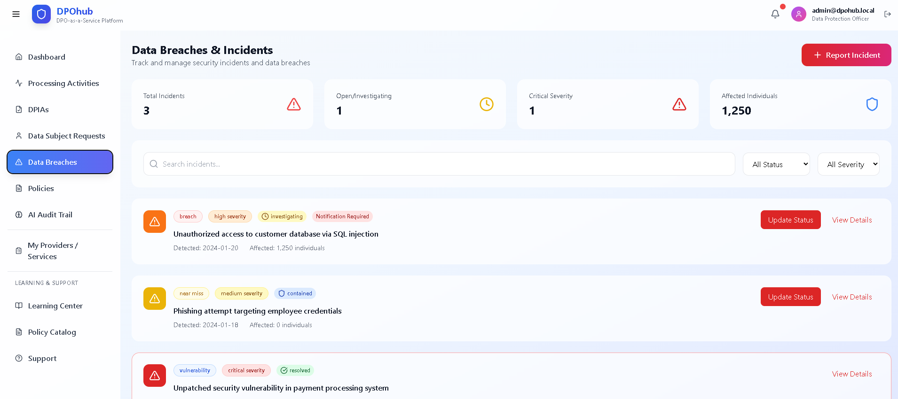
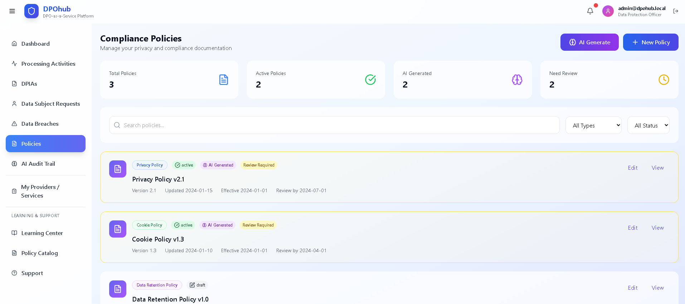
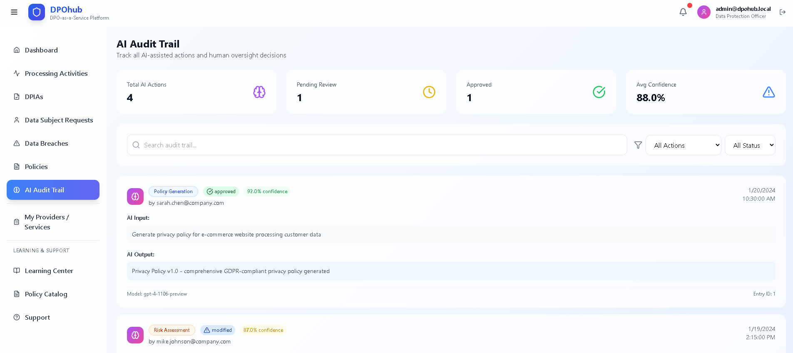

<div align="center">

# Privacy Guard

**An AI-assisted data-protection (DPO) platform**

[](https://nextjs.org)
[](https://www.typescriptlang.org)
[](https://tailwindcss.com)
[]()

*An AI co-pilot for data protection officers - requests, records, and compliance in one place.*

</div>

---

## What Is This?

Privacy Guard is an AI-assisted platform for data protection officers. It helps manage data-subject requests, maintain records of processing, draft policies, and track GDPR-style compliance tasks from a single dashboard.

---

## Features

| Feature | Description | Status |
|---|---|:---:|
| Compliance dashboard | Tasks, status, and risk at a glance | ✅ |
| Data-subject requests | Intake and track access/deletion | ✅ |
| AI DPO assistant | Drafts policies and guidance | 🚧 |
| Records of processing | Maintain the processing register | 🚧 |
| Audit trail | Activity and evidence log | 🚧 |

---

## How It Works

```
Data subjects ──▶ requests (access · deletion)
        │
        ▼
AI DPO assistant ◀──▶ records of processing · policies
        │
        ▼
Compliance dashboard (GDPR tasks · audits)
```

---

## Tech Stack

| Layer | Technology |
|-------|------------|
| Frontend | Next.js, React, TypeScript |
| Styling | Tailwind CSS, shadcn/ui |
| AI | Assistant / drafting layer |

---

## Project Structure

```
privacy-guard-ai-dpo-platform/
migrations/
   1/
   10/
   11/
   12/
   13/
   14/
src/
   react-app/
   shared/
   worker/
.gitignore
eslint.config.js
index.html
package.json
package-lock.json
postcss.config.js
README.md
tailwind.config.js
tsconfig.app.json
tsconfig.frontend.json
tsconfig.json
tsconfig.node.json
tsconfig.worker.json
vite.config.ts
wrangler.json
```

---

## Screenshots

<table>
<tr><td width="50%"></td><td width="50%"></td></tr>
<tr><td width="50%"></td><td width="50%"></td></tr>
<tr><td width="50%"></td><td width="50%"></td></tr>
<tr><td width="50%"></td><td width="50%"></td></tr>
<tr><td width="50%"></td><td width="50%"></td></tr>
<tr><td width="50%"></td></tr>
</table>

---

## Getting Started

```bash
npm install --legacy-peer-deps --ignore-scripts
npx next dev
```

---

## Notes

Shared as a portfolio artifact demonstrating product and system design. Early prototype, not a finished product; not legal advice.

<div align="center">

MIT

</div>
